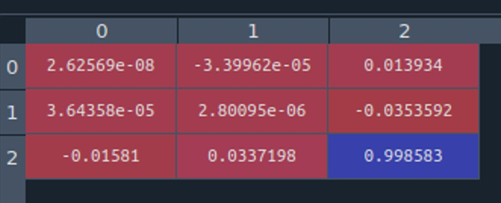
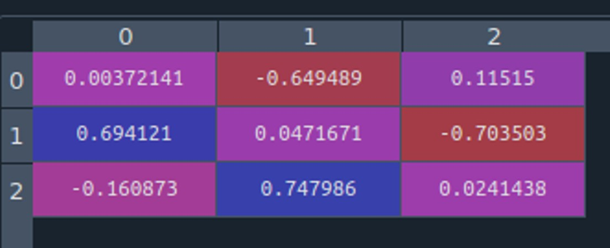
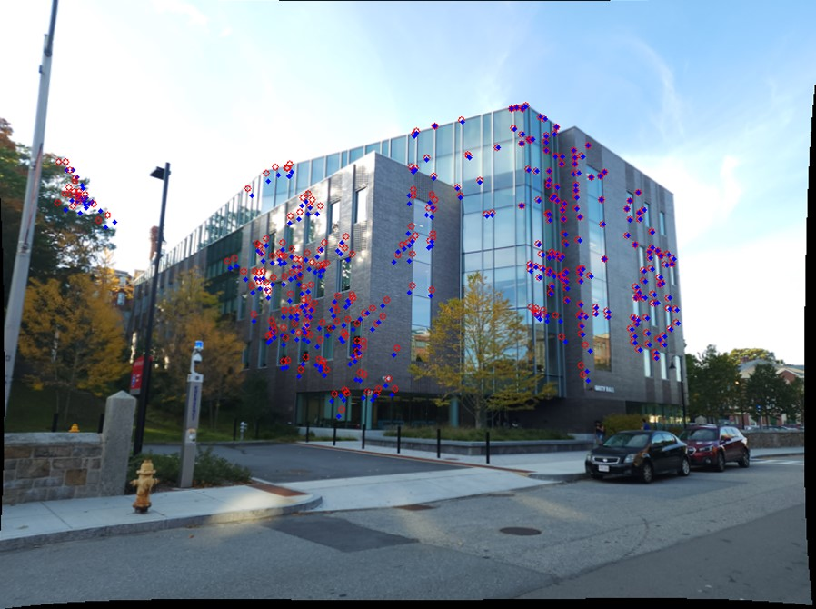
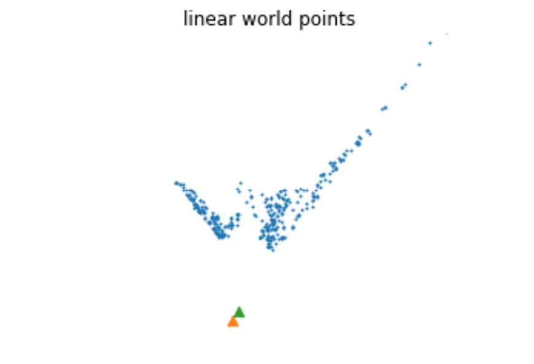
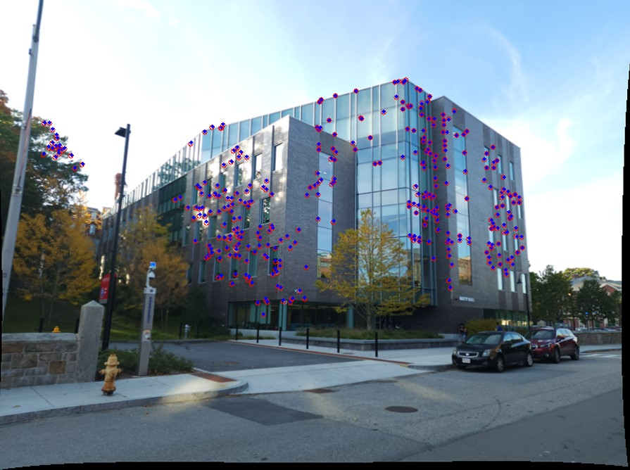
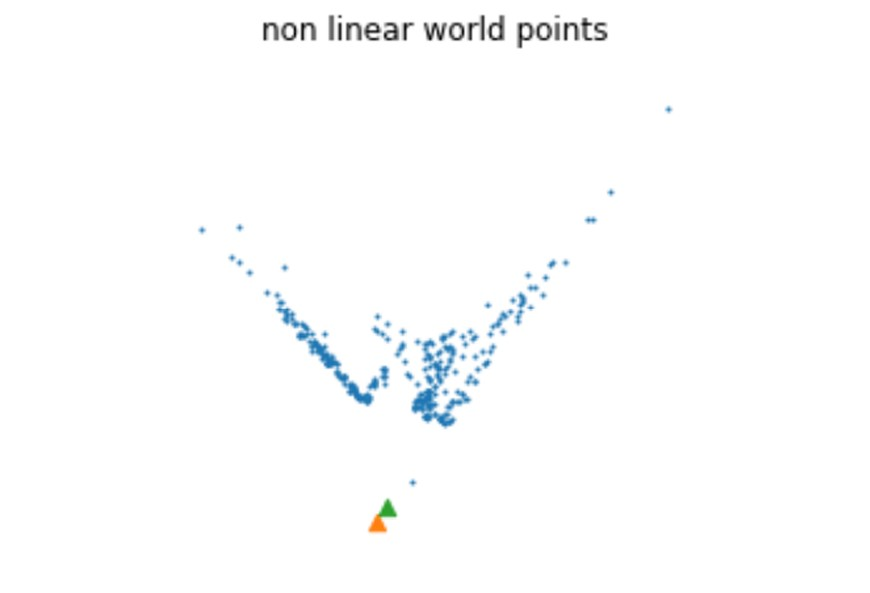
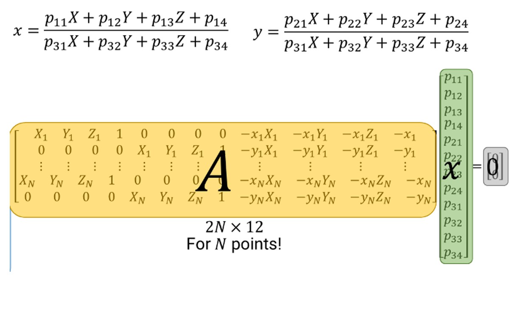
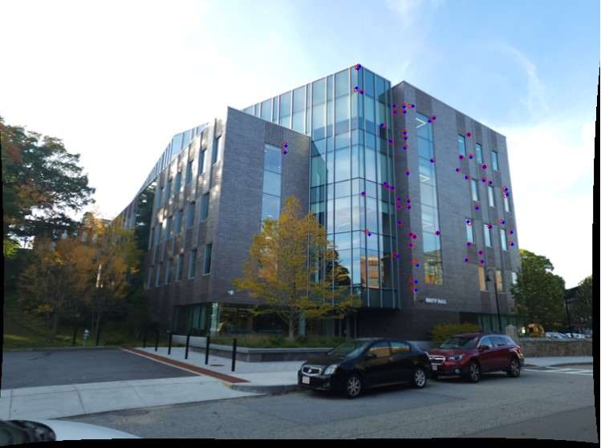
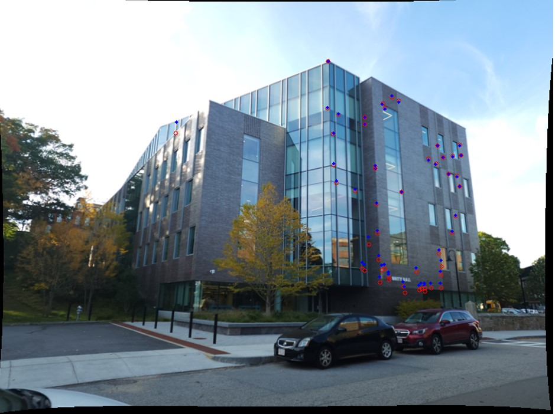
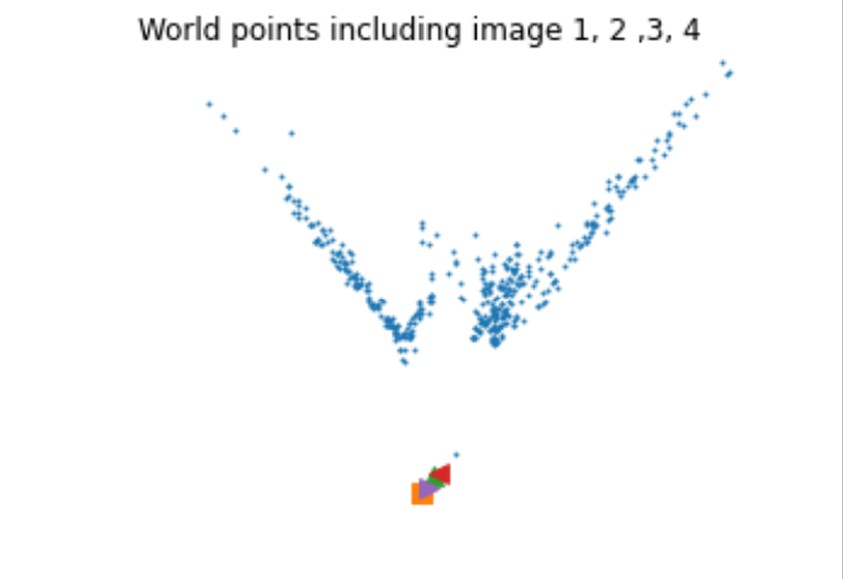

# Structure fom Motion

The objective of this project is to implement Structure from Motion to find camera poses and world points with the help of given images, camera calibration matrix, and feature matches between those images.

The procedure to estimate camera poses and world points in classical approach is as follows:

#### 1. Fundamental Matrix Estimation
The fundamental matrix represents the epipolar geometry between 2 images.
> The fundamental matrix between 2 cameras with corresponding image points $x$ and $x’$ of same world point $X$ is governed by following equation:
>
> $$ x' F^T x = 0 $$

To find the fundamental matrix between 2 cameras using 2 images of similar scene, we need minimum 8 point matches.
>  Let the fundamental matrix be defined as below:
>
> $$ \begin{bmatrix} x'_i & y'_i & 1 \end{bmatrix} \begin{bmatrix} f11 & f12 & f13 \cr f21 & f22 & f23 \cr f13 & f32 & f33 \end{bmatrix} \begin{bmatrix} x_i \cr y_i \cr 1 \end{bmatrix} = 0 $$
>
> To solve for the elements of the fundamental matrix, we need to use the SVD of the A matrix formed using the 8 or more correspondences as shown below:
>
> $$ \begin{bmatrix} x_1x'_1 & x_1y'_1 & x_1 & y_1x'_1 & y_1y'_1 & y_1 & x'_1 & y'_1 & 1 \cr \vdots & \vdots & \vdots & \vdots & \vdots & \vdots & \vdots & \vdots & \vdots \cr x_mx'_m & x_my'_m & x_m & y_mx'_m & y_my'_m & y_m & x'_m & y'_m & 1 \end{bmatrix} \begin{bmatrix} f11 \cr f21 \cr f31 \cr f12 \cr f22 \cr f32 \cr f13 \cr f23 \cr f33 \end{bmatrix} = 0 $$

The fundamental matrix derived by solving above equation is supposed to be a rank 2 matrix for perfect matches. But, due to the noise in the image data the fundamental matrix derived might be rank 3 and needs to be set to rank 2 matrix by changing the last diagonal element of the covariance matrix of the SVD of F matrix.

#### 2. RANSAC Outlier Rejection
To obtain a better estimate of fundamental matrix and remove outliers in the initially found matches (using SIFT feature descriptor here), we perform a RANSAC algorithm. The F matrix with maximum number of inliers and the inliers found using the RANSAC are used further for pose estimation and 3D reconstruction.

#### 3. Essential Matrix Estimation
The essential matrix between 2 cameras represents the epipolar geometry irrespective of the camera matrix between 2 images capturing same scene at the same time. The essential matrix is the specialization of the fundamental matrix to the case of normalized image coordinates.
> The relation between the fundamental matrix (F) and the essential matrix (K) is as follows:
>
> $$ K^T F K = 0 $$

####  4. Camera Pose Estimation
We can find the relative camera pose of second camera with respect to the first camera with the help of the essential matrix.

The underlying assumption in this pose estimation is that the pose matrix for camera1 is assumed to be **[I | 0]**.
> Due to projective ambiguities, we find 4 possible camera poses for the second camera.
>
> Let the essential matrix be rewritten as:
> 
> $$ E = U D V^T $$
>
> The camera pose can be written as:
>
> $$ P = K * [R | t] $$
>
> Here we can find 4 ambiguous poses of second camera as follows:
>
> $$ t_1 = U(:,3) \text{  and  } R_1 = U W V^T $$ $$ t_2 = -U(:,3) \text{  and  } R_2 = U W V^T $$ $$ t_3 = U(:,3) \text{  and  } R_3 = U W^T V^T $$ $$ t_4 = -U(:,3) \text{  and  } R_4 = U W^T V^T $$
>
> Here the W matrix is derived as multiplication of a diagonal matrix with diagonal elements (1,1,0) and a skew symmetric matrix.
>
> $$ W = \begin{bmatrix} 0 & -1 & 0 \cr 1 & 0 & 0 \cr 0 & 0 & 1 \end{bmatrix} $$
>
> $$ \text{If } det (R) = -1 \text{, then the pose is to be corrected by setting } R=-R \text{, and }t=-t $$

####  5.Linear Triangulation
Linear triangulation is used to estimate the world points using the camera pose and image points-feature matches.
> Let the image points using 2 camera describing similar scene $X$ simultaneously be $x$ and $x’$ & let the camera poses of both the cameras be $P$ and $P’$. The pinhole geometry between 2 cameras is as follows:
>
> $$ x = P X \text{ , } x' = P' X $$
>
> Using the identity of cross product of 2 parallel vectors being 0,we can find following equations:
>
> $$ x(p^{3T} X) - (p^{1T} X) = 0 $$ $$ y(p^{3T} X) - (p^{2T} X) = 0 $$ $$ x(p^{2T} X) - y(p^{1T} X) = 0 $$ $$ \text{Here, } p^{iT} \text{ are the rows of } P \text{ matrix} $$
>
> Using both $x$ and $x’$, and $P$ and $P’$, we can form a linear equation $AX=0$ as follows:
>
> $$ A = \begin{bmatrix} xp^{3T} - p^{1T} \cr yp^{3T} - p^{2T} \cr x'p'^{3T} - p'^{1T} \cr x'p'^{3T} - p'^{1T} \end{bmatrix} $$
>
> By solving for $X$ using SVD of $A$ matrix, a linear world point estimate using 2 image points $x$ and $x’$ can be found.

####  6.Triangulation and cheirality check
The ambiguity for the correct pose of second camera is solved using the cheirality check condition.

For cheirality check, the world points are calculated for each possible camera pose of camera 2 and camera 1 pose using linear triangulation as explained above. For the world points $X$ and camera center $C$ the depth positivity/cheirality condition is checked by multiplying the difference between the world point and camera center by the third column of the rotation matrix for the given camera pose, i.e. $r_3(X-C) < 0$ where $r3$ is the third row of transpose of rotation matrix.

Using this condition, the camera 2 pose with most number of points satisfying cheirality condition is selected as the real camera pose.

####  7. NonLinear triangulation
The non linear triangulation is performed to optimize the output of linear triangulation between camera 1 and true camera pose of camera 2.
> The non linear triangulation treats the world points found using linear triangulation as input and optimizes the reprojection error using the pinhole camera model as shown below:
>
> $$ \min_{\rm x} \sum_{j=1,2} \left( u^j - \frac{P^{jT}_1 \tilde{X}}{P^{jT}_3 X} \right)^2 + \left( v^j - \frac{P^{jT}_2 \tilde{X}}{P^{jT}_3 X} \right)^2 $$

The error minimization is done using non linear least squares method with the help of scipy.optimize library.

####  8. Perspective n Points Methodology
The objective of the Perspective-n-Points problem is to find the camera poses of camera3, 4, 5 based on camera1, camera2 poses, and image3 points.

The first step to solve the PnP problem is to create required input data for image1 and image3. Using RANSAC for fundamental matrix, the inliers between image1 and 3 are found. Using [the inliers output corresponding to image 1 after RANSAC between image 1 and 3] and [the inliers output corresponding to image 1 after RANSAC between image 1 and 2], we can find the common inliers corresponding to image 1. This gives us a set of common world points corresponding to the image 1 and image3. We also get a set of unique image points which solely represent the matches between image 1 and 3 and are not common with other images.

#### 9. Linear PnP & PnP RANSAC
Using the image points and world points, camera3 pose can be found by solving following linear equations:

> As Essential Matrix $K$ is already known, the pose of camera i.e. $R$ and $t$ can be found as follows
>
> $$ K [R | t] = \gamma \begin{bmatrix} p1 & p2 & p3 & p4 \end{bmatrix} $$ $$ \gamma R = K^{-1} \begin{bmatrix} p1 & p2 & p3 \end{bmatrix} $$
>
> Let $UDV^T$ be the SVD decomposition of the RHS of above equation and let $D = diag(d1, d2, d3)$.
>
> The SVD cleanup to convert the rotation matrix into an orthogonal matrix, and to recover the scale of translation vector is as follows:
>
> $$ R = U V^T $$ $$ T = \frac{p4 * K^{-1}}{d1}

To get a better estimate of the PnP matrix against the noise present in the input data, we run the RANSAC algorithm. The RANSAC gives the $P3$ matrix which gives maximum number of inliers.

#### 10. Non Linear PnP
The non linear optimization is used to minimize the reprojection error for image 3 onward.

> The reprojection error minimization is
>
> $$ \min_{\rm C,R} \sum_{i=1,J} \left( u^j - \frac{P^{jT}_1 \tilde{X_j}}{P^{jT}_3 X_j} \right)^2 + \left( v^j - \frac{P^{jT}_2 \tilde{X_j}}{P^{jT}_3 X_j} \right)^2 $$

#### 11. World points using PnP & Bundle Adjustment
The optimized PnP matrices for  camera 3,4,5, etc are further used to find the world points corresponding to the image 3,4,5 etc.

The world point estimates are found using the linear triangulation followed by non linear triangulation.

After computing all the camera poses and 3D points, the bundle adjustment is used to refine the camera pose and world  point estimates of all cameras.To improve the speed of the implementation of bundle adjustment, a visibility matrix is used to minimize the reprojection error for the 3D points which are visible to particular cameras only.

#### Final Structure:

